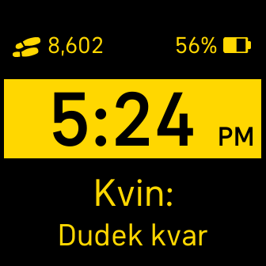

# Language Clock
This watch-face is designed for language learners. Below the standard 12/24 hour digital clock, the current hours and minutes are displayed written in the selected language. This gives language learners an opportunity to practice the use of foreign words for numbers in a practical setting. 

By default after installation, the watch-face will display English words. To change the language displayed, go to the watch-face settings screen on the phone. This can be done by navigating to the selected watch-face on the phone Fitbit app, and clicking the Customize button. Click the "Select Language" button, and choose a language from the displayed list. The color the watch-face can also be selected and changed in the settings screen. 

Note: The watch-face should be selected and running on the phone while changing the selected language and color within the phone app. If the watch-face is not currently running on the Fitbit watch, then the setting changes might not take on the watch. 

Note: This watch-face is not yet published to the Fitbit app store. 

[Fitbit App Gallery listing](https://gallery.fitbit.com/details/7cbb3907-9a5c-413d-b066-77202726486c?key=0f7c31d1-c7cc-4bb4-8b95-341c4b53f7b8) 

---
Settings panel for watch-face in Fitbit phone app: 

---
**Current supported Languages:**
- Chinese 
- English  
- Esperanto 
- French  
- German  
- Greek  
- Hawaiian  
- Hungarian  
- Italian  
- Latin 
- Spanish 
- Ukrainian
